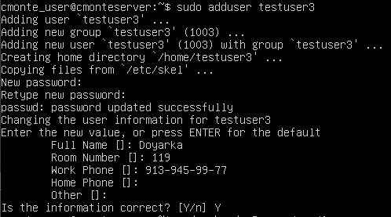
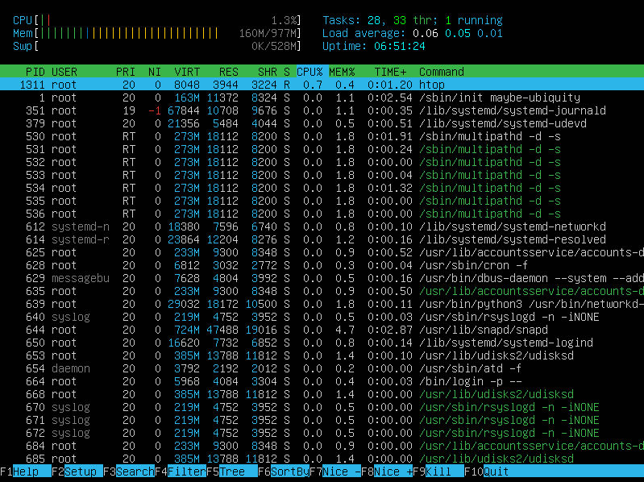

## Part 1. Установка ОС.

- Скачиваем и устанавливаем программу для виртуализации [VirtualBox](https://www.virtualbox.org).
- Скачиваем и устанавливаем [Ubuntu 20.04 Server LTS](https://ubuntu.com/download/server) без графического интерфейса.
- Для просмотра версии Ubuntu используем команду: `cat /etc/issue`  
	    

## Part 2. Создание пользователя.

- Создание нового пользователя командой:
    `sudo adduser <username>`  
	

- Обеспечение доступа на чтение логов из папки /var/log:
    `sudo chmod -R o+r /var/log`
- Создание нового пользовотеля проверяется вызовом комманды:
    `cat /etc/passwd`  
    

## Part 3. Настройка сети ОС.
- Для того, чтобы задать другое имя машины необходимо открыть в текстовом редакторе файл с именем машины и изменить его там:
    `sudo vim /etc/hostname`.
Сохраняем файл и перезапускаем машину.
- Перед сменой часового пояса вам нужно узнать имя часового пояса, которое вы хотите использовать.
Часовые пояса используют формат «Регион/Город». Чтобы вывести список всех доступных часовых поясов, вы можете вызвать команду timedatectl с опцией list-timezones:
    `timedatectl list-timezones`.
- Для смены временной зоны применяем седующую команду:
    `sudo timedatectl set-timezone <your_time_zone>`.
Например в данном случае автор использовал команду 
    `sudo timedatectl set-timezone Asia/Novosibirsk`.
Вызовите команду timedatectl, чтобы проверить изменения:
    `timedatectl`:

    

- Для вывода списка имён сетевых интерфейсов используем команду:
    `ifconfig -a`.
Данная команда предварительно не установлена в Ubuntu 20.04 Server LTS, установите пакет net-tools при помощи команды
    `sudo apt install net-tools`.   

    

    __lo__ 127.0.0.1 известен как __local loopback__ но вы можете увидеть его под именем __localhost__.
Служит для подключения компьютера к самому себе. Это удобно, когда вы хотите подключиться к серверу на своем компьютере.
- Для получитполучения ip-адреса устройства, на котором вы работаете, от DHCP сервера используем консольную команду:
    `sudo dhcpcd -h enp0s3`.
При необходимости используйте команду:
    `sudo apt install dhcpcd5`.  

    

    __DHCP__ (англ. Dynamic Host Configuration Protocol — протокол динамической настройки узла) — прикладной протокол, позволяющий сетевым устройствам автоматически получать IP-адрес и другие параметры, необходимые для работы в сети TCP/IP. Данный протокол работает по модели «клиент-сервер». Для автоматической конфигурации компьютер-клиент на этапе конфигурации сетевого устройства обращается к так называемому серверу DHCP и получает от него нужные параметры. Сетевой администратор может задать диапазон адресов, распределяемых сервером среди компьютеров. Это позволяет избежать ручной настройки компьютеров сети и уменьшает количество ошибок. Протокол DHCP используется в большинстве сетей TCP/IP.
- Для определения и вывода на экран внешнего ip-адрес шлюза (ip) и внутреннего IP-адрес шлюза (он же ip-адрес по умолчанию (gw)) можно использовать комманду:
    `netstat -rn`:
    
    

- Конфигурирование сетевого интерфейса происходит в конфмгурационном файле на языке YAML. Он находится в каталоге /etc/netplan. Откроем его при помощи редатокора vim:
    `sudo vim /etc/netplan/*.yamlc`.   
Приводим настройки к следующему виду: 

    

Для применения изменений: `sudo netplan apply`.   
Проверяем настройки: `ifconfig enp0s3`.   
Успешно пингуем удалённые хосты:  

    

## Part 4. Обновление ОС.

- Для обновления пакетов, введите в терминале последовательно следующие команды.     
`sudo apt upgrade`     
`sudo apt full-upgrade`     
- После повторного ввода выдается сообщение:     

    

## Part 5. Использование команды __sudo__

- Основная идея команды sudo — дать пользователям как можно меньше прав, при этом достаточных для решения поставленных задач. 

- Чтобы разрешить пользователю выполнять команду sudo вводим команду:   
`sudo usermod -aG sudo <username>`   
Для смены пользователя в терминале нужно выполнять команду su:   
`su <username>`     
Изменяем hostname как это указано в __Part 2__       
- Изменённый hostname:     

## Part 6. Установка и настройка службы времени

- Временная зона, в которой вы сейчас находитесь, была установлена в __part 3__.      
Для того, чтобы вывести время необходимо применить команду date с форматом вывода +%X     
`date +%T`   
- Ubuntu стандартно устанавливается с ntpdate и будет запускать его при каждой загрузке один раз для установки времени по NTP серверу Ubuntu.     
- Проверяем командами:     
`timedatectl status` и `timedatectl show`     

    

## Part 7. Установка и использование текстовых редакторов

- Установить текстовые редакторы VIM, NANO, JOE используя комнду:     
`sudo atp install <название_редактора>`     
- Используя каждый из трех выбранных редакторов, создайте файл test_X.txt, где X -- название редактора, в котором создан файл. Напишите в нём свой никнейм, закройте файл с сохранением изменений.
    * vim      
     
Для сохраниения назжмите `Esc`, затем `Shift`+`:`, введите `wq!`, нажмите `Enter`.
    * nano     
      
Для сохранения последовательно нажмите `Ctrl+X`, `Y`, `Enter`. 
    * joe     
      
Для сохранения последовательно нажмите `Ctrl+K`, `Q`, `Y`.     
- Используя каждый из трех выбранных редакторов, откройте файл на редактирование, отредактируйте файл, заменив никнейм на строку "21 School 21", закройте файл без сохранения изменений.    
    * vim     
     
Для сохраниения назжмите `Esc`, затем `Shift`+`:`, введите `q!`, нажмите `Enter`.
    * nano     
      
Для сохранения последовательно нажмите `Ctrl+X`, `N`, `Enter`. 
    * joe     
      
Для сохранения последовательно нажмите `Ctrl+K`, `Q`, `N`.
- Используя каждый из трех выбранных редакторов, отредактируйте файл ещё раз (по аналогии с предыдущим пунктом), а затем освойте функции поиска по содержимому файла (слово) и замены слова на любое другое.    
    * vim     
Переход в режим поиска происходит из обычного режима вводом:     
`/` - поиск от курсора до концо документа     
`?` - поиск от курсора до начала документа    
    
для замены слова на другое необходимо использовать конструкцию `:s/cmonte/justgame/`     
     
    * nano   
Для поиска используем комбинацию клавиш `Ctrl+W`, далее вводим поисковую строку.     
      
Для замены, в режиме поиска `Ctrl+W` необходимо нажать `Ctrl+R` и ввести желаемую для замены подвердить ввод нажатием клавиши в `Enter`, после успешного нахождения паттерна вводим новую строку и подверждаем `Enter`, соглашаемся с заменой `Y`.    
      
    * joe    
Для перехода в режим поиска нажимаем  `Ctrl+K`, `F`, далее вводим поисковую строку.   
     
Для замены в режиме поиска `Ctrl+K`, `F`, вводим искомое слово, нажимаем `R`, `Enter`, далее вводим строку замены , после подверждаем действие нажатием `Y`.     

## Part 8. Установка и базовая настройка сервиса SSHD

- OpenSSH (Open Secure Shell) — набор программ, который позволяет шифровать сеансы связи в сети. При таких сеансах используется протокол SSH. Служба sshd является одним из компонентов OpenSSH, для его установки сипользуем команду:              
`sudo apt install ssh`    

- Для добавления автостарта службы при загрузке системы используем команду:     
`sudo systemctl enable ssh`     

- Перенастроить службу SSHd на порт 2022.   
Для смены порта необходимо зменить порт на нужный в файле `sshd_config` сохранить изменения и перезапрустить демон SSH.    
`sudo vim /etc/ssh/sshd_config`     
`systemctl restart sshd`    

- Используя команду ps, показать наличие процесса sshd. Для этого к команде нужно подобрать ключи.    
`ps -C sshd`    
Команда `ps` выводит список текущих процессов на сервере. Опция `C` фильтрует процессы по указанной строке.
- Для перезагрузки системы необходимо использовать команду reboot:
`sudo reboot`   
Вывод команды `netstat -tan`:    
   
    * Значение ключей -tan:     
-t - Отображение текущего подключения в состоянии переноса нагрузки с процессора на сетевой адаптер при передаче данных ( "offload" ).   
-a - Отображение всех подключений и ожидающих портов.    
-n - Отображение адресов и номеров портов в числовом формате.   
    * значение каждого столбца вывода:     
__Proto__ - название протокола.    
__Recv-Q__ - количество байтов, не скопированных пользовательской программой, подключенной к этому сокету.    
__Send-Q__ - количество байтов, не подтвержденных удаленным хостом. 
__Local adress__ - локальный IP-адрес участвующий в соединении или связанный со службой, ожидающей входящие соединения (слушающей порт). Если в качестве адреса отображается `0.0.0.0` , то это означает - "любой адрес", т.е в соединении могут использоваться все IP-адреса существующие на данном компьютере. Адрес 127.0.0.1 - это петлевой интерфейс, используемый в качестве средства IP протокола для взаимодействия между процессами без реальной передачи данных.    
__Foreign adress__ - Внешний IP-адрес, участвующий в создании соединения.  
__State__ - состояние соединения. Состояние Listening говорит о том, что строка состояния отображает информацию о сетевой службе, ожидающей входящие соединения по соответствующему протоколу на адрес и порт, отображаемые в колонке "Локальный адрес ". Состояние ESTABLISHED указывает на активное соединение. В колонке "Состояние" для соединений по протоколу TCP может отображаться текущий этап TCP-сессии определяемый по обработке значений флагов в заголовке TCP - пакета (Syn, Ask, Fin ... ). Возможные состояния:    
_CLOSE_WAIT_ - ожидание закрытия соединения.  
_CLOSED_ - соединение закрыто.  
_ESTABLISHED_ - соединение установлено.  
_LISTENING_ - ожидается соединение (слушается порт).  
_TIME_WAIT_ - превышение времени ответа. 
    * значение 0.0.0.0 означает - "любой адрес".

## Part 9. Установка и использование утилит __top__, __htop__     
- выводы команды __top__:   
     
    * uptime - 6:29;     
    * количество авторизованных пользователей - 1;     
    * общая загрузка системы - 0.00, 0.00, 0.00;     
    * Общее количесво процессов - (91);     
    * загрузка cpu - 0.0;     
    * загрузка памяти - 155.7Mib     
    * pid процесса занимающего больше всего памяти - 1;     
    * pid процесса, занимающего больше всего процессорного времени - 1284;     
- скрины в выводами команды htop:     
    * Сортировка по PID     
  
    * Сортировка по PERCENT_CPU     
 
    * Сортировка по PERSENT_MEM     
  
    * Сортировка по TIME     
  
    *с процессом syslog, найденным, используя поиск      
  
    *с добавленным выводом hostname, clock и uptime      

## Part 10. Использование утилиты __fdisk__ 
- запускаем `sudo fdisk -l`    
   
- название - sda;     
- размер - 5 GiB;     
- количество секторов - 10485760;     
- размер swap `swapon --show` - 528M;     

## Part 11. Использование утилиты __df__

- Запустить команду df.      

- В отчёте написать для корневого раздела (/):  
  * размер раздела - 4316848 KiB
  * размер занятого пространства - 305020 KiB
  * размер свободного пространства - 12 KiB
  * процент использования - 75%
  * The 1K block in GNU coreutils df(1) means 1024 bytes

- Запустить команду df -Th.  

- В отчёте написать для корневого раздела (/):
  * размер раздела - 4.2G
  * размер занятого пространства - 3.0G
  * размер свободного пространства - 1004M
  * процент использования - 75%
  * тип файловой системы - ext4

## Part 12. Использование утилиты __du__

- Запустить команду du. Вывести размер папок /home, /var, /var/log   
вывод команды `du -hbs /var/log /var /home`:     
   
- Вывести размер всего содержимого в /var/log (используя *)  
вывод команды `du -kh /var/log`:     
   

## Part 13. Установка и использование утилиты __ncdu__

- Установить утилиту ncdu:     
`sudo apt-get install ncdu`    
- Запускаем сканирование дискового пространсва командой    
`sudo ncdu /`    
После сканирования используем клавишу `i` на необходимом нам каталоге.    
 * /home      

 * /var       

 * /var/log     

## Part 14. Работа с системными журналами
- Открыть для просмотра:     
  * `sudo vim /var/log/dmesg`       
  * `sudo vim /var/log/syslog`    
  * `sudo vim /var/log/auth.log`    
- Скрин последней успешной авторизации:     
    
- время последней успешной авторизации - 11:12:41    
- имя пользователя и метод входа в систему - justgame и login   
-     

## Part 15. Использование планировщика заданий __CRON__

- Используя планировщик заданий, запустите команду uptime через каждые 2 минуты.   
Задачи в cron записываются и управляются в специальном файле `crontab` 
- Найти в системных журналах строчки (минимум две в заданном временном диапазоне) о выполнении.     
    
- Вывести на экран список текущих заданий для CRON.     
    
- Удалите все задания из планировщика заданий.   
    
