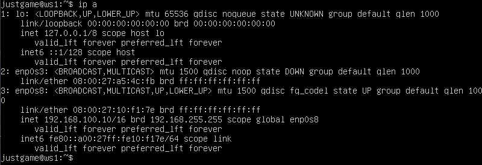
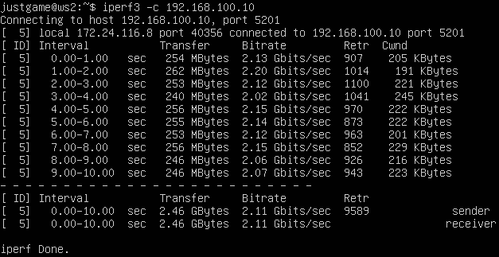
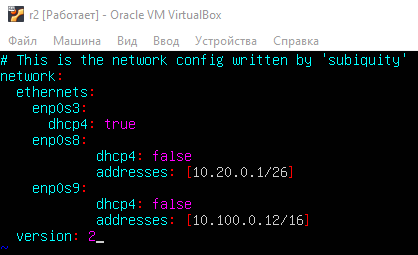
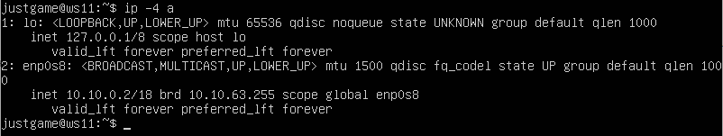

## Part 1. Инструмент __ipcalc__
---
### 1.1. Сети и маски

Определить и записать в отчёт:  

1. Адрес сети 192.167.38.54/13 - 192.160.0.0  
2. - Перевод маски 255.255.255.0  
        * Префиксная - /24  
        * Двоичная - 11111111.11111111.11111111.00000000
    - Перевод маски /15
        * Обычная - 255.254.0.0
        * Двоичная - 11111111.11111110.00000000.00000000
    - Перевод маски 11111111.11111111.11111111.11110000
		* Обычная - 255.255.255.240
		* Префиксная - /28  

3. - Минимальный и максимальный хост в сети 12.167.38.4 при маске /8:  
        * HostMin - 12.0.0.1  
        * HostMax - 12.255.255.254  
    - Минимальный и максимальный хост в сети 12.167.38.4 при маске 11111111.11111111.00000000.00000000:
	    * HostMin - 12.167.0.1  
		* HostMax - 12.167.255.254
    - Минимальный и максимальный хост в сети 12.167.38.4 при маске 255.255.254.0:
        * HostMin - 12.167.38.1  
        * HostMax - 12.167.39.254 
    - Минимальный и максимальный хост в сети 12.167.38.4 при маске /4:
        * HostMin - 0.0.0.1  
        * HostMax - 15.255.255.254

### 1.2. localhost

Определить и записать в отчёт, можно ли обратиться к приложению, работающему на localhost, со следующими IP:
- 194.34.23.100 - нет
- 127.0.0.2 - да
- 127.1.0.1 - да
- 128.0.0.1 - нет

```
localhost (так называемый, «местный» от англ. local, или «локальный хост», по смыслу — этот компьютер) — в компьютерных сетях, стандартное, официально зарезервированное доменное имя для частных IP-адресов (в диапазоне 127.0.0.1 — 127.255.255.254, RFC 2606).
```


### 1.3. Диапазоны и сегменты сетей

Определить и записать в отчёт:

- какие из перечисленных IP можно использовать в качестве публичного, а какие только в качестве частных:
    *  10.0.0.45 - частная сеть
    *  134.43.0.2 - публичная сеть
    *  192.168.4.2 - частная сеть
    *  172.20.250.4 - частная сеть
    *  172.0.2.1 - публичная сеть
    *  192.172.0.1 - публичная сеть
    *  172.68.0.2 - публичная сеть
    *  172.16.255.255 -  частная сеть
    *  10.10.10.10 - частная сеть
    *  192.169.168.1 - публичная сеть

- 2) какие из перечисленных IP адресов шлюза возможны у сети 10.10.0.0/18: 
    *  10.0.0.1 - нет
    *  10.10.0.2 - да
    *  10.10.10.10 - да
    *  10.10.100.1 - нет 
    *  10.10.1.255 - да

## Part 2. Статическая маршрутизация между двумя машинами
---
- Поднять две виртуальные машины (далее -- ws1 и ws2)
- С помощью команды ip a посмотреть существующие сетевые интерфейсы
    * Cкрин с вызовом и выводом использованной команды `ip a` для ws1:  
    
    * Cкрин с вызовом и выводом использованной команды `ip a` для ws2:  
    
- Описать сетевой интерфейс, соответствующий внутренней сети, на обеих машинах и задать следующие адреса и маски: ws1 - 192.168.100.10, маска /16, ws2 - 172.24.116.8, маска /12. В отчёт поместить скрины с содержанием изменённого файла etc/netplan/00-installer-config.yaml для каждой машины.
    * для ws1:  
    
    * для ws2:  
    
- Выполнить команду netplan apply для перезапуска сервиса сети, В отчёт поместить скрин с вызовом и выводом использованной команды.
    * для ws1:  
    
    * для ws2:  
    

## 2.1. Добавление статического маршрута вручную

 - Добавить статический маршрут от одной машины до другой и обратно при помощи команды вида ip r add:  
    * для ws1:  
      
    * для ws2:  
      
- Пропинговать соединение между машинами
    * для ws1:  
      
    * для ws2:  
      

## 2.2. Добавление статического маршрута с сохранением

 - Перезапустить машины `sudo reboot`
 - Добавить статический маршрут от одной машины до другой с помощью файла etc/netplan/00-installer-config.yaml  
    * для ws1:  
      
    * для ws2:  
      
- Пропинговать соединение между машинами  
    * для ws1:  
      
    * для ws2:  
      

## Part 3. Утилита iperf3
---
### 3.1. Скорость соединения
- Перевести и записать в отчёт 8 Mbps в MB/s, 100 MB/s в Kbps, 1 Gbps в Mbps:
	* 8 Mbps = 1 MB/s
	* 100 MB/s = 819200 Kbps
	* 1 Gbps = 1024 Mbps
### 3.2. Утилита iperf3  
- Измерить скорость соединения между ws1 и ws2: 
	* ws1 выступает в роли сервера:  
     
	* ws2 выступает в роли клиента:  
     

## Part 4. Сетевой экран
---
### 4.1. Утилита iptables
- Создать файл /etc/firewall.sh, имитирующий фаерволл, на ws1 и ws2:

- Нужно добавить в файл подряд следующие правила:
	1) на ws1 применить стратегию когда в начале пишется запрещающее правило, а в конце пишется разрешающее правило (это касается пунктов 4 и 5)
	2) на ws2 применить стратегию когда в начале пишется разрешающее правило, а в конце пишется запрещающее правило (это касается пунктов 4 и 5)
	3) открыть на машинах доступ для порта 22 (ssh) и порта 80 (http)
	4) запретить echo reply (машина не должна "пинговаться”)
	5) разрешить echo reply (машина должна "пинговаться")
	* Содержание файла firewall.sh на ws1:  
	
	* Содержание файла firewall.sh на ws2:  
	 


- Запустить файлы на обеих машинах командами `chmod +x /etc/firewall.sh` и `/etc/firewall.sh`  
	* Запуск firewall.sh на ws1:  
	 
	* Запуск firewall.sh на ws1:  
	  
	* ping  
	  
- В отчёте описать разницу между стратегиями, применёнными в первом и втором файлах.  
Работает первое правило, при отсутствии подходящего правила работает политика по-умолчанию.  

### 4.1. Утилита nmap

- Командой ping найти машину, которая не "пингуется", после чего утилитой nmap показать, что хост машины запущен
Проверка: в выводе nmap должно быть сказано: Host is up
	* вызов и вывод команды ping и nmap:  
	 

- Сохранить дампы образов виртуальных машин:  
[Инструкция](https://comphome.ru/virtualbox-virtualnaja-mashina/kak-sohranit-sostojanie-virtualnoj-mashiny-virtualbox.html) по сохранению дампа.

## Part 5. Статическая маршрутизация сети
---
Сеть:  
  
Поднять пять виртуальных машин (3 рабочие станции (ws11, ws21, ws22) и 2 роутера (r1, r2))  

### 5.1. Настройка адресов машин  

- Настроить конфигурации машин в etc/netplan/00-installer-config.yaml согласно сети на рисунке.
	* Содержание файла _00-installer-config.yaml_ для ws11:  
	  

	* Содержание файла _00-installer-config.yaml_ для ws21:  
	  

	* Содержание файла _00-installer-config.yaml_ для ws22:  
	  

	* Содержание файла _00-installer-config.yaml_ для r1:  
	  

	* Содержание файла _00-installer-config.yaml_ для r2:   
	  

	Перезапустить сервис сети.
	`sudo netplan apply`

- Если ошибок нет, то командой `ip -4 a` проверить, что адрес машины задан верно. Также пропинговать ws22 с ws21. Аналогично пропинговать r1 с ws11.
	*  Вызов и вывод `ip -4 a` на ws11:  
	  
	*  Вызов и вывод `ip -4 a` на ws21:  
	  
	*  Вызов и вывод `ip -4 a` на ws22:  
	  
	*  Вызов и вывод `ip -4 a` на r1:  
	  
	*  Вызов и вывод `ip -4 a` на r2:  
	  
	* Ping ws22 с ws21:  
	  
	* Ping r1 с ws11:  
	  

### 5.2. Включение переадресации IP-адресов.
- Для включения переадресации IP, выполните команду на роутерах:  
`sysctl -w net.ipv4.ip_forward=1`  
При таком подходе переадресация не будет работать после перезагрузки системы.
	*  Вызов и вывод `sysctl -w net.ipv4.ip_forward=1` на r1:  
	 
	*  Вызов и вывод `sysctl -w net.ipv4.ip_forward=1` на r2:  
	 

- Откройте файл /etc/sysctl.conf и добавьте в него следующую строку:  
_net.ipv4.ip_forward = 1_  
При использовании этого подхода, IP-переадресация включена на постоянной основе.  

* Cодержание изменённого файла /etc/sysctl.conf на r1:  
 
* Cодержание изменённого файла /etc/sysctl.conf на r2:  
  

Применить изменения без перезагрузки машины : `sysctl -p`  

### 5.3. Установка маршрута по-умолчанию
Пример вывода команды `ip r` после добавления шлюза:
```
default via 10.10.0.1 dev eth0
10.10.0.0/18 dev eth0 proto kernel scope link src 10.10.0.2
```
- Настроить маршрут по-умолчанию (шлюз) для рабочих станций. Для этого добавить gateway4 \[ip роутера\] в файле конфигураций:  
	* содержание файла *etc/netplan/00-installer-config.yaml* на ws11:  
	
	* содержание файла *etc/netplan/00-installer-config.yaml* на ws21:  
	
	* содержание файла *etc/netplan/00-installer-config.yaml* на ws22:  
	
	* содержание файла *etc/netplan/00-installer-config.yaml* на r1:  
	
	* содержание файла *etc/netplan/00-installer-config.yaml* на r2:  
	

- Вызвать `ip r` и показать, что добавился маршрут в таблицу маршрутизации:  
	* Вызов и вывод `ip r` на ws11:  
	
	* Вызов и вывод `ip r` на ws21:  
	
	* Вызов и вывод `ip r` на ws22:  
	
	* Вызов и вывод `ip r` на r1:  
	
	* Вызов и вывод `ip r` на r2:  
	

- Пропинговать с ws11 роутер r2 и показать на r2, что пинг доходит. Для этого использовать команду:  
`tcpdump -tn -i enp0s8`
	* Вызов и вывод команды `ping` на ws11:  
	
	* Вызов и вывод команды `tcpdump -tn -i enp0s8`:  
	

### 5.4. Добавление статических маршрутов

- Добавить в роутеры r1 и r2 статические маршруты в файле конфигураций: 
	* содержание изменённого файла *etc/netplan/00-installer-config.yaml* для r1:  
	
	* содержание изменённого файла *etc/netplan/00-installer-config.yaml* для r2:  
	

- Вызвать `ip r` и показать таблицы с маршрутами на обоих роутерах:  
    * Отключение неиспользуемого сетевого интерфейса: `ip link set dev enp0s3 down`
	* Вызов и вывод `ip r` на r1:  
	
	* Вызов и вывод `ip r` на r2:  
	

- Запустить команды на ws11:
`ip r list 10.10.0.0/[маска сети]` и `ip r list 0.0.0.0/0`
	* Вызов и вывод `ip r list 10.10.0.0/18`:  
	
	* Вызов и вывод `ip r list 0.0.0.0/0`:  
	
- В отчёте объяснить, почему для адреса 10.10.0.0/\[порт сети\] был выбран маршрут, отличный от 0.0.0.0/0, хотя он попадает под маршрут по-умолчанию:  
Маршрут по умолчанию имеет более низкий приоритет и срабатывает, когда не найден подходящий маршрут в таблице маршрутизации. Для сети 10.10.0.0 мы создали правило, соответственно используется созданный маршрут. Также можно устанавливать метрику, чтобы менять приоритеты маршрутов.  

### 5.5. Построение списка маршрутизаторов
- Запустить на r1 команду дампа:  
`tcpdump -tnv -i enp0s9`

- При помощи утилиты __traceroute__ построить список маршрутизаторов на пути от ws11 до ws21
	* Вызов и вывод `tcpdump` на r1:  
	   
	* Вызов и вывод `traceroute` на ws11:  
	
- В отчёте, опираясь на вывод, полученный из дампа на r1, объяснить принцип работы построения пути при помощи traceroute:  
Traceroute обрисовывает путь, по которому IP-пакет следует к хосту, запуская тестовые пакеты UDP с небольшим TTL (время жизни), а затем прослушивая ICMP-ответ «превышено время» от шлюза. Мы запускаем наши тесты с TTL=1 и увеличиваем его на единицу, пока не получим ICMP «порт недоступен» (что означает, что пакет прибыл в пункт назначения) или не достигнем максимального значения попыток, которое по умолчанию составляет 30.

### 5.6. Использование протокола ICMP при маршрутизации
- Запустить на r1 перехват сетевого трафика, проходящего через enp0s8 с помощью команды:   
`tcpdump -n -i eth0 icmp`  
	* Вызов и вывод `tcpdump -n -i eth0 icmp` на r1:   
	  
      

- Пропинговать с ws11 несуществующий IP (например, 10.30.0.111) с помощью команды:    
`ping -c 1 10.30.0.111`  
	* Вызов и вывод `ping -c 1 10.30.0.111` на ws11:     
	

- Сохранить дампы образов виртуальных машин

## Part 6. Динамическая настройка IP с помощью __DHCP__

- Указать MAC адрес у ws11, для этого в _etc/netplan/00-installer-config.yaml_ надо добавить строки: `macaddress: 10:10:10:10:10:BA`, `dhcp4: true`  

	* Содержанием изменённого файла _etc/netplan/00-installer-config.yaml_:  
	

- Для r2 настроить в файле _/etc/dhcp/dhcpd.conf_ конфигурацию службы __DHCP__:
	1) указать адрес маршрутизатора по-умолчанию, DNS-сервер и адрес внутренней сети.  
        
	2) в файле _resolv.conf_ прописать `nameserver 8.8.8.8.`
	 	* Cодержание _resolv.conf_ на r2:  
	 	

- Перезагрузить службу **DHCP** командой `systemctl restart isc-dhcp-server`.   Машину ws21 перезагрузить при помощи `reboot` и через `ip a` показать, что она получила адрес. Также пропинговать ws22 с ws21.  
    * скрин с применением команды:  
    
	* Вызов и вывод `ip a` на ws21:  
	
	* Вызов и вывод `ping` ws22 c ws21:   
	

- Для r1 настроить аналогично, но сделать выдачу адресов с жесткой привязкой к MAC-адресу (ws11). Провести аналогичные тесты.  
	* Cодержание _/etc/dhcp/dhcpd.conf_ на r1:  
	
	* Cодержание _resolv.conf_ на r1:  
	
    * скрин с применением команды:  
    
	* Вызов и вывод `ip a` на ws11:  
	
	* Вызов и вывод `ping` ws22 c ws11:   
	

- Запросить с ws21 обновление ip адреса: 
	* Чтобы обновить или освободить IP-адрес для конкретного интерфейса, например, enp0s8, введите:
		```
		$ sudo dhclient -r enp0s8
		$ sudo dhclient enp0s8
		``` 
	* ip на ws21 до обновления:  
	
	* ip на ws21 после обновления:  
	

- Сохранить дампы образов виртуальных машин

## Часть 7. __NАТ__

- В файле _/etc/apache2/ports.conf_ на ws22 и r2 изменить строку Listen 80 на Listen 0.0.0.0:80, то есть сделать сервер Apache2 общедоступным
	* Содержание изменённого файла _/etc/apache2/ports.conf_:  
	  
	


- Запустить веб-сервер Apache командой `service apache2 start` на ws22 и r1: 
	* Вызов и вывод `service apache2 start`:  
	  
	

- Добавить в фаервол, созданный по аналогии с фаерволом из Части 4, на r2 следующие правила:
	1) Удаление правил в таблице _filter_ `iptables -F`
	2) Удаление правил в таблице _"NAT"_ `iptables -F -t nat`
	3) Отбрасывать все маршрутизируемые пакеты `iptables --policy FORWARD DROP`  
	

	Запускать файл также, как в Части 4

- Проверить соединение между ws22 и r1 командой `ping`  
При запуске файла с этими правилами, ws22 не должна "пинговаться" с r1
	* Вызов и вывод `ping` ws22 с r1:  
	

- Добавить в файл ещё одно правило:

	4) Разрешить маршрутизацию всех пакетов протокола ICMP  
	Для этого добавляем правило в фаервол:  
	`iptables -A FORWARD -p icmp -j ACCEPT`  
	Запускать файл также, как в Части 4.  
	  

- Проверить соединение между ws22 и r1 командой `ping`  
	При запуске файла с этими правилами, ws22 должна "пинговаться" с r1
	* Вызов и вывод `ping` ws22 с r1:  
	  

- Добавить в файл ещё два правила:

	5) Включить __SNAT__, а именно маскирование всех локальных ip из локальной сети, находящейся за r2 (по обозначениям из Части 5 - сеть 10.20.0.0)  
	_Совет: стоит подумать о маршрутизации внутренних пакетов, а также внешних пакетов с установленным соединением_

	6) Включить __DNAT__ на 8080 порт машины r2 и добавить к веб-серверу Apache, запущенному на ws22, доступ извне сети  
	_Совет: стоит учесть, что при попытке подключения возникнет новое tcp-соединение, предназначенное ws22 и 80 порту_
	* Cодержание изменённого файла _firewall.sh_:  
	  


- Запускать файл также, как в Части 4.  

	Перед тестированием рекомендуется отключить сетевой интерфейс NAT (его наличие можно проверить командой ip a) в VirtualBox, если он включен.

- Проверить соединение по TCP для SNAT, для этого с ws22 подключиться к серверу Apache на r1 командой:  
`telnet [адрес] [порт]`  
	* Вывод и вызов `telnet 10.100.0.12 8080` на ws22:  
	  

- Проверить соединение по TCP для DNAT, для этого с r1 подключиться к серверу Apache на ws22 командой `telnet` (обращаться по адресу r2 и порту 8080)
	* Вывод и вызов `telnet 10.100.0.12 80` на ws22:  
	  

- Сохранить дампы образов виртуальных машин

## Дополнительно. Знакомство с __SSH Tunnels__

- Запустить веб-сервер Apache на ws22 только на localhost (то есть не изменять файл /etc/apache2/ports.conf или, если был изменен ранее, вернуть строку Listen 80)  
	- Содержание файла _ports.conf_:  
	  

- Воспользоваться Local TCP forwarding с ws21 до ws22, чтобы получить доступ к веб-серверу на ws22 с ws21
	* Проверка службы  ssh: 
	`systemctl status ssh`
	* Включить переадресацию локальных портов:  
	`ssh -L local_port:remote_ip:remote_port user@hostname.com`
	* Вызов и вывод `ssh -L`:  
	 
	* Проверка telnet:  
	 
- Воспользоваться Remote TCP forwarding c ws11 до ws22, чтобы получить доступ к веб-серверу на ws22 с ws11
	* Переброс удаленного порта:  
	`$ ssh -R remote_port:local_ip:local_port user@hostname.com`
	* Вызов и вывод `ssh -L`:  
	 
	* Проверка telnet:  
	 

- Сохранить дампы образов виртуальных машин