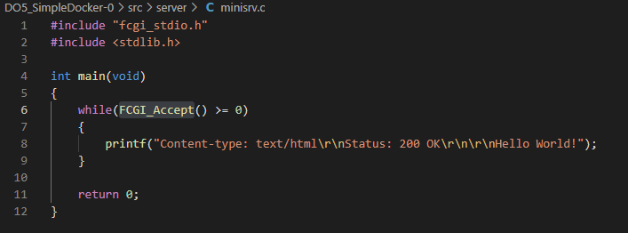
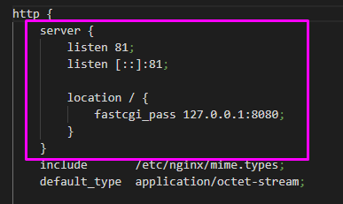
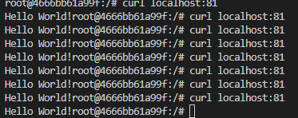

## Part 3. Мини веб-сервер
---
Настало время немного оторваться от докера, чтобы подготовиться к последнему этапу. Настало время написать свой сервер.

__== Задание ==__

#### Написать мини сервер на C и FastCgi, который будет возвращать простейшую страничку с надписью Hello World!  

  

#### Запустить написанный мини сервер через spawn-cgi на порту 8080   

- `sudo docker pull nginx`

- `sudo docker run -d -p 8080:81 --name mafaka nginx`

- `sudo docker cp server/minisrv.c mafaka:minisrv.c` 

- `sudo docker exec -it mafaka bash`

- `apt update` 

- `apt-get install libfcgi-dev -y`  

- `apt-get install spawn-fcgi -y`  

- `apt-get install gcc -y`   

- `gcc minisrv.c -lfcgi -o minisrv`  

- `spawn-fcgi -p 8080 ./minisrv`  

- `service nginx start`  

#### Написать свой nginx.conf, который будет проксировать все запросы с 81 порта на 127.0.0.1:8080  

  

- `sudo docker cp nginx/nginx.conf mafaka:etc/nginx/nginx.conf`

- `sudo docker exec mafaka nginx -s reload`

#### Проверить, что в браузере по localhost:81 отдается написанная вами страничка  

- `curl localhost:81`  

 

#### Положить файл nginx.conf по пути ./nginx/nginx.conf (это понадобиться позже)  

- `cp etc/nginx/nginx.conf nginx/nginx.conf`

- `exit`

- `sudo docker stop mafaka`

- Удалить образ, удалить контейнеры  

    `sudo docker rm $(sudo docker ps -a -f status=exited -q)`  
    
    `sudo docker rmi $(sudo docker images -a -q)`

## Part 4. Свой докер
----

Теперь всё готово. Можно приступать к написанию докер образа для созданного сервера.

__== Задание ==__

При написании докер образа избегайте множественных вызовов команд RUN

#### Написать свой докер образ, который:

1. собирает исходники мини сервера на FastCgi из Части 3

2. запускает его на 8080 порту

3. копирует внутрь образа написанный ./nginx/nginx.conf

4. запускает nginx.

nginx можно установить внутрь докера самостоятельно, а можно воспользоваться готовым образом с nginx'ом, как базовым.

#### Собрать написанный докер образ через `docker build` при этом указав имя и тег

- `sudo docker build -t miniserver:untag .` 

#### Проверить через `docker images`, что все собралось корректно

- `sudo docker images`  

#### Запустить собранный докер образ с маппингом 81 порта на 80 на локальной машине и маппингом папки *./nginx* внутрь контейнера по адресу, где лежат конфигурационные файлы **nginx**'а (см. [Часть 2](#part-2-операции-с-контейнером))

- `sudo docker run -it -p 80:81 --name test -v /home/student/DO5_SimpleDocker-0/src/nginx/:/etc/nginx -d miniserver:untag bash`

#### Проверить, что по localhost:80 доступна страничка написанного мини сервера

- `curl localhost:80`  

- `curl localhost:80/status`  

#### Экспортировать контейнер в файл *container.tar* через команду *export*

- `sudo docker container export test > containerp4.tar`

- Остановить контейнер  

    `sudo docker stop test`

- Удалить образ, удалить контейнеры  

    `sudo docker rm $(sudo docker ps -a -f status=exited -q)`  
    
    `sudo docker rmi $(sudo docker images -a -q)`

- Импортировать контейнер 

    `sudo docker import --change "USER boogerman" --change "HEALTHCHECK --interval=10s --timeout=30s --start-period=5s --retries=3 CMD curl -sS 127.0.0.1 || exit 1" containerp4.tar testserver:imported`

- Запустить импортированный контейнер  

    `sudo docker images`

    `sudo docker run -it -p 80:81 --name test -v /home/student/DO5_SimpleDocker-0/src/nginx/:/etc/nginx -d testserver:imported bash`

- (запускаем nginx внутри контейнера)

    `sudo docker exec test spawn-fcgi -p 8080 web/minisrv`

    `sudo docker exec test service nginx start`

- Проверить: 

    `curl localhost:80/status`

    `curl localhost:80` 

## Part 5. Dockle  
----
После написания контейнера никогда не будет лишним проверить его на безопасность.  

- Импортировать контейнер: 

    1. `sudo docker import --change "USER boogerman" --change "HEALTHCHECK --interval=10s --timeout=30s --start-period=5s --retries=3 CMD curl -sS 127.0.0.1 || exit 1" containerp5.tar testserver:imported`

- запуск контейнера:

    1. `sudo docker run -it -p 80:81 --name test -v /home/student/DO5_SimpleDocker-0/src/nginx/:/etc/nginx -d testserver:imported bash`  

    2. `sudo docker exec test spawn-fcgi -p 8080 web/minisrv`  

    3. `sudo docker exec test service nginx start`  

#### Просканировать контейнер из предыдущего задания через dockle [container_id|container_name]  

- `sudo dockle testserver:imported`  

#### Исправить контейнер так, чтобы при проверке через dockle не было ошибок и предупреждений     

## Part 6. Базовый Docker Compose  
---
- Остановить контейнер   

    `sudo docker stop test`  

- Удалить образ, удалить контейнеры  

    `sudo docker rm $(sudo docker ps -a -f status=exited -q)`  
    
    `sudo docker rmi $(sudo docker images -a -q)`  

- Сборка и запуск

    `sudo docker-compose build`

    `sudo docker-compose up`

- Проверить: 

    `curl localhost:80/status`

    `curl localhost:80` 

    `sudo docker-compose down`